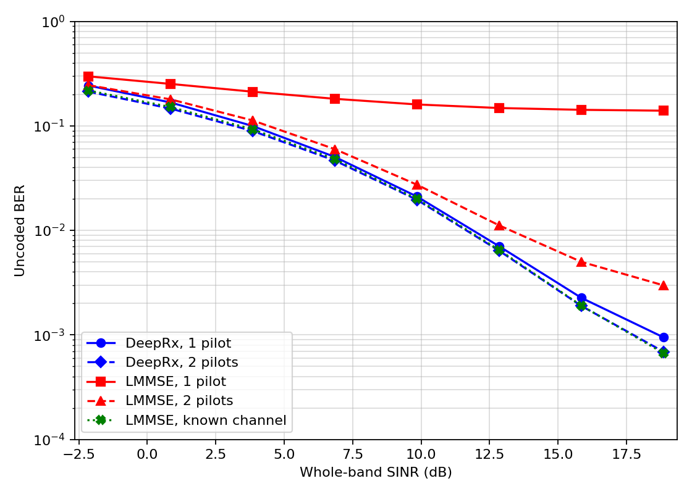

# DeepRx Reproduction

This repository provides a MATLAB-to-PyTorch reproduction workflow for:

> M. Honkala, D. Korpi, and J. M. J. Huttunen, "DeepRx: Fully Convolutional Deep Learning Receiver," *IEEE Transactions on Wireless Communications*, vol. 20, no. 6, pp. 3925-3940, June 2021. [doi:10.1109/TWC.2021.3054520](https://doi.org/10.1109/TWC.2021.3054520)

The project uses standards-grade MATLAB PUSCH simulation to generate deterministic training and validation samples, trains a MathWorks-compatible DeepRx network in PyTorch, and reproduces the uncoded-BER comparison in paper Fig. 6(a).

## Reproduced Result

The figure below was generated by this repository from a 30,000-step PyTorch checkpoint and a fresh Monte Carlo evaluation with 500 samples for every SNR and pilot configuration.

> **SNR-axis note.** The figure uses the completed MC=500 BER values and converts the MATLAB R2025b per-resource-element SNR to the paper's whole-band definition with `SNR_whole-band = SNR_per-RE - 10*log10(512/312)`, a 2.151 dB left shift. No BER values were interpolated or recomputed.

Configuration:

- Training: 30,000 steps, 8 frames per step, 10 TTIs per frame, seed 2026.
- Evaluation: SINR points <code>0:3:21</code> dB, 500 Monte Carlo samples per point and pilot configuration, 1 frame per sample.
- Receiver curves: DeepRx, practical LMMSE, and known-channel LMMSE.
- Pilot configurations: one pilot (<code>DMRSAdditionalPosition=0</code>) and two pilots (<code>DMRSAdditionalPosition=1</code>).

| SINR (dB) | DeepRx, 1 pilot | DeepRx, 2 pilots | LMMSE, 1 pilot | LMMSE, 2 pilots | LMMSE, known channel |
|---:|---:|---:|---:|---:|---:|
| 0  | 0.243110 | 0.212479 | 0.297745 | 0.245152 | 0.218123 |
| 3  | 0.167463 | 0.146412 | 0.252029 | 0.179338 | 0.151425 |
| 6  | 0.099677 | 0.089253 | 0.212255 | 0.112639 | 0.092569 |
| 9  | 0.050451 | 0.046554 | 0.181497 | 0.059864 | 0.047991 |
| 12 | 0.021057 | 0.019601 | 0.160301 | 0.027335 | 0.019982 |
| 15 | 0.007042 | 0.006379 | 0.148176 | 0.011162 | 0.006488 |
| 18 | 0.002262 | 0.001893 | 0.142385 | 0.004999 | 0.001908 |
| 21 | 0.000948 | 0.000690 | 0.139749 | 0.002980 | 0.000669 |

The machine-readable values are stored in [docs/assets/figure6a_30k_mc500_metrics.json](docs/assets/figure6a_30k_mc500_metrics.json).

## System Architecture

~~~mermaid
flowchart LR
    A["Deterministic paper-protocol index seed, split, frame, channel parameters"]
    B["MATLAB R2025b 5G Toolbox PUSCH / LDPC / DM-RS / TDL-CDL"]
    C["MATLAB Engine for Python array and parameter bridge"]
    D["Memory-mapped training cache inputs, target bits, data mask, bit mask"]
    E["PyTorch DeepRx masked BCE training"]
    F["Atomic checkpoints full state + MATLAB-loadable state dict"]
    G["MATLAB validation DeepRx + practical LMMSE + known-channel LMMSE"]
    H["JSON metrics and BER figure"]

    A --> B
    B --> C
    C --> D
    D --> E
    E --> F
    F --> G
    A --> G
    G --> H
~~~

### Data flow

1. <code>src/deeprx/matlab_bridge.py</code> maps a deterministic global frame index to channel, SNR, delay spread, Doppler, and DM-RS parameters.
2. <code>matlab/deeprx_export_official_batch.m</code> calls the MathWorks PUSCH simulation and exports MATLAB arrays with layouts <code>[F,S,C,N]</code>, <code>[F,S,B,N]</code>, and <code>[F,S,1,N]</code>.
3. The Python bridge converts them to PyTorch layouts <code>[N,C,F,S]</code>, <code>[N,B,F,S]</code>, and <code>[N,1,F,S]</code>.
4. <code>src/deeprx/training_cache.py</code> stores the fixed train split as <code>float32</code> NumPy memory maps and reads each 8-frame training step in deterministic order.
5. <code>scripts/train_official_matlab.py</code> trains DeepRx and atomically writes a resumable full checkpoint plus a pure state dictionary.
6. <code>scripts/reproduce_figure6a.py</code> asks MATLAB to evaluate DeepRx and both LMMSE baselines. Progress is atomically saved after every completed SNR point.
7. <code>src/deeprx/official_experiments.py</code> writes final JSON metrics and the semilog BER plot.

## Repository Layout

| Path | Responsibility |
|---|---|
| <code>src/deeprx/model.py</code> | MathWorks-compatible DeepRx network, bit masking, masked BCE loss, and BER calculation. |
| <code>src/deeprx/matlab_bridge.py</code> | MATLAB Engine paths, deterministic dataset protocol, tensor conversion, and MATLAB calls. |
| <code>src/deeprx/training_cache.py</code> | Resumable memory-mapped cache creation and deterministic cache-backed batches. |
| <code>src/deeprx/official_experiments.py</code> | Fig. 6(a) Monte Carlo loop, SNR-level resume state, metrics, and plotting. |
| <code>scripts/build_training_cache.py</code> | Command-line entry point for the MATLAB-generated training cache. |
| <code>scripts/train_official_matlab.py</code> | LAMB/AdamW training with checkpoint and resume support. |
| <code>scripts/reproduce_figure6a.py</code> | DeepRx/LMMSE Fig. 6(a) evaluation and plotting. |
| <code>scripts/check_prereqs.py</code> | Path, PyTorch/CUDA, MATLAB, GPU, and support-package checks. |
| <code>matlab/</code> | MathWorks-derived runtime helpers plus project-specific wrappers. |
| <code>official/</code> | MathWorks PyTorch coexecution helpers and supplied checkpoint. |
| <code>config/deeprx_paths.json</code> | Local MATLAB, Python, and 6G Exploration Library paths. |
| <code>tests/</code> | Regression tests for model, bridge, cache, optimizer schedule, and scripts. |
| <code>docs/assets/</code> | Published reproduction figure and machine-readable metrics. |

## MathWorks Source and Provenance

The standards-based simulation chain is derived from MathWorks example assets for AI-native PUSCH receiver workflows and from the **6G Exploration Library for 5G Toolbox**. The verified support-package installation used version <code>25.2.0 (R2025b)</code>.

MathWorks-derived files retain their original copyright notices:

- <code>matlab/HARQEntity.m</code>
- <code>matlab/hGetAdditionalSystemParameters.m</code>
- <code>matlab/hGetFeaturesAndLabels.m</code>
- <code>official/deeprx_model.py</code>
- <code>official/deeprx.py</code>
- <code>official/hCreateTorchDeepRx.m</code>
- <code>official/helperLibraryChecker.m</code>
- <code>official/helperSetupPyenv.m</code>
- <code>official/helperinstalledlibs.py</code>
- <code>official/deeprx_30k.pth</code>

Files prefixed with <code>deeprx_</code> under <code>matlab/</code>, together with the Python package under <code>src/deeprx/</code>, are repository integration code. They connect the MathWorks simulation to PyTorch training and evaluation without replacing the standards-grade PUSCH chain.

The MathWorks components require valid product licenses and must be used under their applicable MathWorks terms. Relevant product documentation:

- [5G Toolbox](https://www.mathworks.com/products/5g.html)
- [Communications Toolbox](https://www.mathworks.com/products/communications.html)
- [MATLAB Engine API for Python](https://www.mathworks.com/help/matlab/matlab-engine-for-python.html)

Install **6G Exploration Library for 5G Toolbox** through MATLAB Add-On Explorer for the same MATLAB release.

## Requirements

### Tested environment

- Windows 11, 64-bit.
- MATLAB R2025b.
- 5G Toolbox.
- Communications Toolbox.
- 6G Exploration Library for 5G Toolbox <code>25.2.0 (R2025b)</code>.
- Python 3.9.
- PyTorch <code>2.8.0+cu128</code>.
- NVIDIA CUDA-capable GPU. The full run was verified on an 8 GB laptop GPU.

### Storage and memory

- The full fixed training cache contains 30,000 frames and occupies about 73.2 GiB.
- Use an SSD with at least 80 GiB free for the cache, plus space for checkpoints and outputs.
- The 8-frame training batch nearly fills an 8 GB GPU. Do not run full MC evaluation concurrently with training on an 8 GB GPU.
- Long Windows runs should use a system-managed page file or an explicitly sized page file with sufficient commit capacity.

## Installation

Run all commands from the repository root in PowerShell.

~~~powershell
git clone https://github.com/Tonyerwite/DeepRX.git
cd DeepRX

py -3.9 -m venv .venv
.\.venv\Scripts\python.exe -m pip install --upgrade pip
.\.venv\Scripts\python.exe -m pip install -r requirements-cuda.txt
~~~

Install the MATLAB Engine package from the local MATLAB installation. Replace <code>&lt;MATLAB_ROOT&gt;</code> with the actual installation directory.

~~~powershell
.\.venv\Scripts\python.exe -m pip install "<MATLAB_ROOT>\extern\engines\python"
~~~

CPU-only smoke tests can use <code>requirements.txt</code>, but the paper-scale 80-TTI training run is intended for CUDA.

## Path Configuration

Edit <code>config/deeprx_paths.json</code> for the local machine:

~~~json
{
  "matlab": {
    "r2025b_executable": "C:/Program Files/MATLAB/R2025b/bin/matlab.exe"
  },
  "python": {
    "venv_python": "C:/path/to/DeepRx/.venv/Scripts/python.exe"
  },
  "matlab_support": {
    "six_g_support_package_path": "C:/ProgramData/MATLAB/SupportPackages/R2025b/toolbox/5g/supportpackages/pre6g"
  }
}
~~~

Use forward slashes or escaped backslashes in JSON. The Python path must point to the same environment in which PyTorch and MATLAB Engine are installed.

Run the prerequisite check:

~~~powershell
.\.venv\Scripts\python.exe scripts\check_prereqs.py
~~~

The check validates configured paths, runtime files, PyTorch/CUDA availability, the 6G add-on, and MATLAB GPU visibility.

## Complete Parameter Configuration

### Communication and dataset parameters

| Parameter | Value |
|---|---|
| Carrier frequency | 4.0 GHz |
| Resource blocks | 26 |
| Subcarriers | 312 |
| Subcarrier spacing | 15 kHz |
| Cyclic prefix | Normal |
| OFDM symbols per slot | 14 |
| PUSCH allocation | Full resource grid |
| Mapping type | A |
| Modulation | 16QAM |
| Target code rate | <code>658/1024</code> (<code>0.642578125</code>) |
| Transform precoding | Disabled |
| Transmission scheme | Non-codebook |
| Layers / TX antennas / RX antennas | 1 / 1 / 2 |
| Cell ID / RNTI | 0 / 1 |
| DM-RS Type-A position | 2 |
| DM-RS length | 1 |
| CDM groups without data | 2 |
| DM-RS additional position | Train: random 0 or 1; evaluation: 0 or 1 for one or two pilots |
| DM-RS configuration type | Random 1 or 2 |
| Training SNR | Uniform from -4 to 32 dB |
| Fig. 6(a) SINR grid | 0, 3, 6, 9, 12, 15, 18, 21 dB |
| Delay spread | Uniform from 10 ns to 300 ns |
| Maximum Doppler shift | Uniform from 0 to 500 Hz |
| Training channels | CDL-B, CDL-C, CDL-D, TDL-B, TDL-C, TDL-D |
| Validation channels | CDL-A, CDL-E, TDL-A, TDL-E |
| Dataset scale | 500,000 TTIs |
| TTIs per generated frame | 10 |
| Split | 60% train / 40% validation |
| Train / validation frames | 30,000 / 20,000 |
| LDPC decoder | Normalized min-sum, maximum 6 iterations |
| HARQ | Disabled |

### DeepRx model

| Parameter | Value |
|---|---|
| Input | Received grid + DM-RS grid + raw LS channel estimate |
| Input tensor | <code>[N, 10, 312, 14]</code> for 2 RX antennas |
| Output tensor | <code>[N, 4, 312, 14]</code> for 16QAM |
| Residual blocks | 11 preactivation blocks |
| Block channels | 64, 64, 128, 128, 256, 256, 256, 128, 128, 64, 64 |
| Dilation schedule | <code>(1,1)</code>, <code>(2,3)</code>, and <code>(3,6)</code> according to the block configuration |
| Depth multiplier | 2 |
| Trainable parameters | 1,232,516 |
| Loss | Masked binary cross entropy with logits |
| Bit convention | Positive logit means bit 1 |

### Training

| Parameter | Value |
|---|---|
| Steps | 30,000 |
| Frames per step | 8 |
| Effective TTIs per step | 80 |
| Optimizer | LAMB |
| Base learning rate | <code>1e-2</code> |
| Weight decay | <code>1e-4</code> |
| LAMB beta1 / beta2 | 0.9 / 0.999 |
| LAMB epsilon | <code>1e-6</code> |
| Warmup | 800 steps, linear |
| Decay start | Step 9,000 (30% of training) |
| Decay | Linear to zero at step 30,000 |
| Seed | 2026 |
| Log interval | 10 steps |
| Checkpoint interval | 500 steps |
| Cache dtype | <code>float32</code> NumPy memory maps |

The paper specifies the main training scale and schedule but does not publish the original dataset seed, exact frame order, or LAMB beta/epsilon values. This repository exposes those choices and fixes them deterministically. Results should therefore be described as paper-protocol aligned, not bit-identical to the authors' private dataset.

## Run the Reproduction

### 1. Run smoke tests

~~~powershell
.\.venv\Scripts\python.exe -m pytest -q
.\.venv\Scripts\python.exe scripts\train_official_matlab.py --steps 1 --n-frames 1 --device cuda --output outputs\train_smoke.pt
.\.venv\Scripts\python.exe scripts\reproduce_figure6a.py --snr-points 0 --samples-per-point 1 --n-frames 1 --output-dir outputs\figure6a_smoke
~~~

### 2. Build the fixed training cache

The default cache location is <code>data/paper_train_cache</code>, which is excluded from Git. For a large external SSD, pass an explicit path:

~~~powershell
$CacheDir = "E:\DeepRxCache\paper_train_cache"
.\.venv\Scripts\python.exe scripts\build_training_cache.py --cache-dir $CacheDir --seed 2026 --progress-every 100
~~~

If cache generation is interrupted, run the same command again. It resumes from <code>completed_frames</code> in <code>metadata.json</code>. Use <code>--overwrite</code> only to intentionally discard an existing cache.

### 3. Train for 30,000 steps

~~~powershell
$CacheDir = "E:\DeepRxCache\paper_train_cache"
.\.venv\Scripts\python.exe scripts\train_official_matlab.py --steps 30000 --n-frames 8 --optimizer lamb --lr 0.01 --weight-decay 0.0001 --lamb-beta1 0.9 --lamb-beta2 0.999 --lamb-eps 0.000001 --warmup-steps 800 --decay-start-fraction 0.3 --device cuda --seed 2026 --cache-dir $CacheDir --output checkpoints\deeprx_official_matlab.pt --save-every 500 --log-every 10
~~~

Outputs:

- <code>checkpoints/deeprx_official_matlab.pt</code>: full model, optimizer, arguments, step count, and training history.
- <code>checkpoints/deeprx_official_matlab_state_dict.pth</code>: model-only state dictionary used by MATLAB/PyTorch coexecution.

Resume an interrupted run with the same parameters:

~~~powershell
$CacheDir = "E:\DeepRxCache\paper_train_cache"
.\.venv\Scripts\python.exe scripts\train_official_matlab.py --steps 30000 --n-frames 8 --optimizer lamb --lr 0.01 --weight-decay 0.0001 --lamb-beta1 0.9 --lamb-beta2 0.999 --lamb-eps 0.000001 --warmup-steps 800 --decay-start-fraction 0.3 --device cuda --seed 2026 --cache-dir $CacheDir --output checkpoints\deeprx_official_matlab.pt --resume checkpoints\deeprx_official_matlab.pt --save-every 500 --log-every 10
~~~

### 4. Run the full MC=500 Fig. 6(a) evaluation

~~~powershell
.\.venv\Scripts\python.exe scripts\reproduce_figure6a.py --checkpoint checkpoints\deeprx_official_matlab_state_dict.pth --samples-per-point 500 --n-frames 1 --seed 2026 --snr-points "0,3,6,9,12,15,18,21" --output-dir outputs\figure6a_30k_mc500
~~~

Evaluation writes:

- <code>figure6a_progress.json</code> after every completed SNR point.
- <code>figure6a_metrics.json</code> when all points finish.
- <code>figure6a_uncoded_ber.png</code> when all points finish.

Rerunning the same command resumes matching progress. Pass <code>--restart</code> only when existing progress should be discarded.

## Reproducibility Notes

- The fixed cache preserves generated MATLAB tensors and deterministic frame order across resumed runs.
- Training checkpoints and evaluation progress are written atomically.
- The default <code>official/deeprx_30k.pth</code> is the MathWorks-supplied checkpoint. Pass a project-trained state dictionary explicitly to evaluate the reproduced model.
- The published figure uses the project-trained 30,000-step checkpoint, not the bundled MathWorks checkpoint.
- The result is a fresh protocol-aligned reproduction and is not claimed to be a digitized or bit-identical copy of the paper figure.

## Verification

~~~powershell
.\.venv\Scripts\python.exe -m pytest -q
~~~

The current suite contains 33 tests. A complete Fig. 6(a) result must contain exactly eight finite values in every curve, <code>samples_per_point=500</code>, <code>n_frames=1</code>, a valid JSON file, and a readable PNG.

## Citation

~~~bibtex
@article{honkala2021deeprx,
  author  = {Honkala, Mikko and Korpi, Dani and Huttunen, Janne M. J.},
  title   = {DeepRx: Fully Convolutional Deep Learning Receiver},
  journal = {IEEE Transactions on Wireless Communications},
  volume  = {20},
  number  = {6},
  pages   = {3925--3940},
  year    = {2021},
  month   = jun,
  doi     = {10.1109/TWC.2021.3054520}
}
~~~
